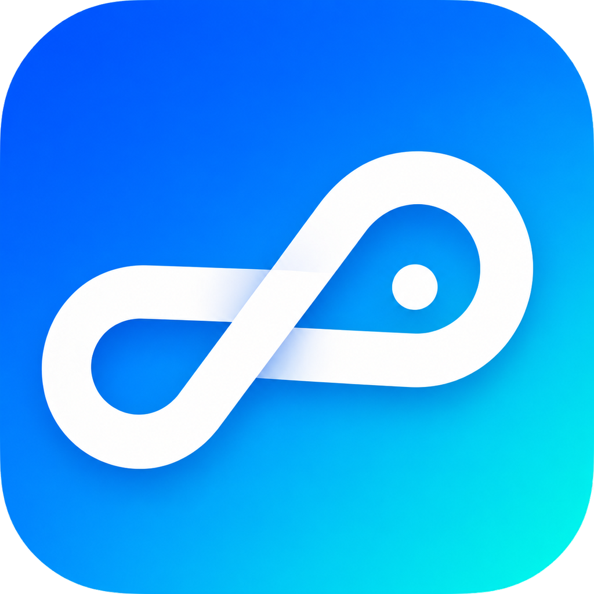
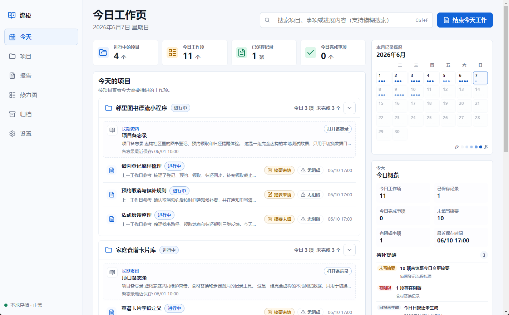
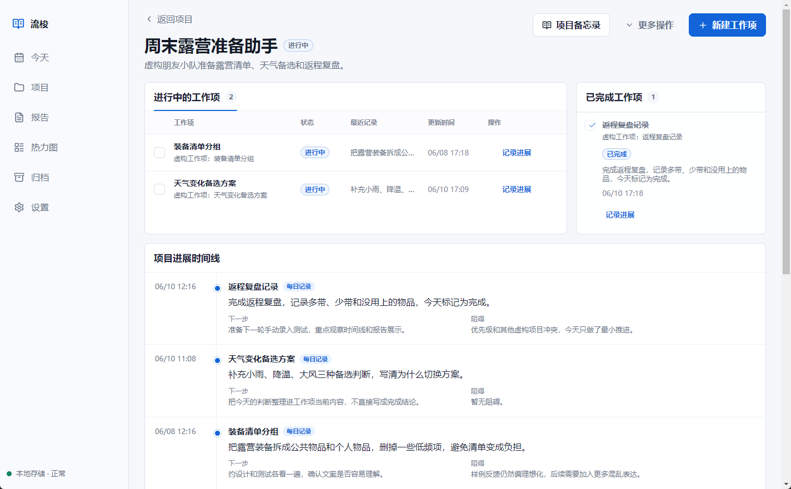
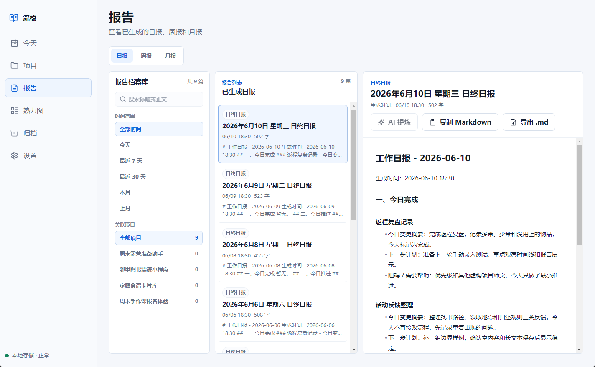
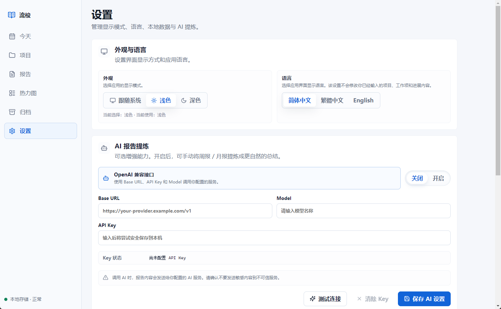

<div align="center">
  

  <h1>流梭 Flow Shuttle</h1>

  <p>
    本地优先的个人工作进展日志工具。<br />
    A local-first personal work progress journal.
  </p>

  <p>
    <a href="#简体中文">简体中文</a> | <a href="#english">English</a>
  </p>

  <p>
    <a href="./ROADMAP.md">Roadmap</a> ·
    <a href="./CHANGELOG.md">Changelog</a> ·
    <a href="./LICENSE">License</a> ·
    <a href="https://github.com/Sunyuanrui915/FlowShuttle/releases">Releases</a>
  </p>
</div>

## 简体中文

### 流梭是什么

流梭 Flow Shuttle 是一款本地优先的桌面端个人工作进展日志工具。它用项目、工作项、每日记录、报告和热力图，把分散的工作过程整理成可回顾、可导出的连续记录。

### 为什么做它

很多知识工作并不是简单的待办完成。进展常常散落在聊天、文档、脑海和临时笔记里；等到写日报、周报或复盘时，才发现上下文已经断开。

流梭希望解决的是这个问题：每天轻量记录一点，把项目推进过程接成线。

### 核心功能

- 项目与工作项管理。
- Today 每日工作页，集中记录当天推进。
- 今日记录编辑页，支持上一工作日参考和 Markdown 写作。
- 日报、周报、月报生成与 Markdown 导出。
- 项目进展时间线。
- 工作活跃度热力图。
- 可选 AI 报告提炼。
- 本地 SQLite 存储，不强制登录，不主动上传工作内容。

### 截图预览










### 安装与使用

普通用户请从 GitHub Releases 下载 Windows 安装包：

[下载最新版本](https://github.com/Sunyuanrui915/FlowShuttle/releases/latest)

当前版本为 `v0.1.0`。这是流梭的首个公开版本，欢迎下载体验并反馈问题。

Flow Shuttle 未进行代码签名，Windows 可能出现安全提示。如果只是日常使用流梭，不需要从源码运行项目。

### 本地开发

Flow Shuttle 使用 Electron、React、TypeScript 和 SQLite。

推荐环境：

- Node.js 20 或更新版本。
- npm 10 或更新版本。

常用命令：

```bash
npm install
npm run dev
npm run typecheck
npm run build
npm run dist:win
```

开发辅助命令：

```bash
# 仅用于本地开发和调试，会生成测试数据。
npm run create:test-data
```

### 隐私与数据

Flow Shuttle 默认把数据保存在本地数据目录中。应用不强制登录，也不会主动上传你的工作内容。

你可以在 Settings / 设置页面中查看当前数据目录、数据库文件和配置文件，也可以手动迁移数据目录。手动搬运不是云同步，不会自动合并两台电脑的数据。

如果启用 AI 报告提炼，报告内容会发送给你自己配置的 AI 服务。未配置 AI 时，该能力不会自动调用外部服务。

### Roadmap

近期计划请查看 [ROADMAP.md](./ROADMAP.md)。

### License

Flow Shuttle 使用 [AGPL-3.0-only](./LICENSE) 许可证。

普通用户本地安装和使用 Flow Shuttle，不需要公开个人数据。若你修改、分发或基于修改版本提供网络服务，需要遵守 AGPL-3.0 的源代码开放要求。

## English

### What Is Flow Shuttle

Flow Shuttle is a local-first desktop journal for personal work progress. It organizes projects, work items, daily notes, reports, and heatmaps into a continuous record that can be reviewed and exported.

### Why It Exists

Knowledge work is not always a simple todo list. Progress is often scattered across chats, documents, memory, and temporary notes. When it is time to write a daily report, weekly report, or project review, the context is easy to lose.

Flow Shuttle is built to help connect each day’s work into a continuous thread.

### Core Features

- Project and work item management.
- Today view for daily progress recording.
- Focused daily record editor with previous-workday reference and Markdown writing.
- Daily, weekly, and monthly report generation.
- Markdown export.
- Project progress timeline.
- Work activity heatmap.
- Optional AI report refinement.
- Local SQLite storage with no required login or forced upload of work content.

### Screenshots


### Installation And Usage

Regular users can download the Windows installer from GitHub Releases:

[Download the latest version](https://github.com/Sunyuanrui915/FlowShuttle/releases/latest)

The current version is `v0.1.0`. This is the first public release of Flow Shuttle, and it is still early. Try it with non-sensitive data first.

Flow Shuttle is not code-signed yet, so Windows may show a security warning. If you only use Flow Shuttle day to day, you do not need to run the project from source.

### Local Development

Flow Shuttle uses Electron, React, TypeScript, and SQLite.

Recommended environment:

- Node.js 20 or newer.
- npm 10 or newer.

Common commands:

```bash
npm install
npm run dev
npm run typecheck
npm run build
npm run dist:win
```

Development helper:

```bash
# Development/debugging only. Generates local test data.
npm run create:test-data
```

### Privacy And Data

Flow Shuttle stores data in a local data directory by default. The app does not require login and does not upload your work content by itself.

The current data directory, database file, and config file can be viewed from Settings. Manual data transfer is not cloud sync and does not automatically merge data from multiple computers.

If AI report refinement is enabled, report content is sent to the AI service configured by you. When AI is not configured, the feature does not call external services automatically.

### Roadmap

See [ROADMAP.md](./ROADMAP.md).

### License

Flow Shuttle is licensed under [AGPL-3.0-only](./LICENSE).

End users can install and use Flow Shuttle locally without publishing personal data. If you modify, distribute, or provide a network service based on a modified version, you must follow the source availability requirements of AGPL-3.0.
